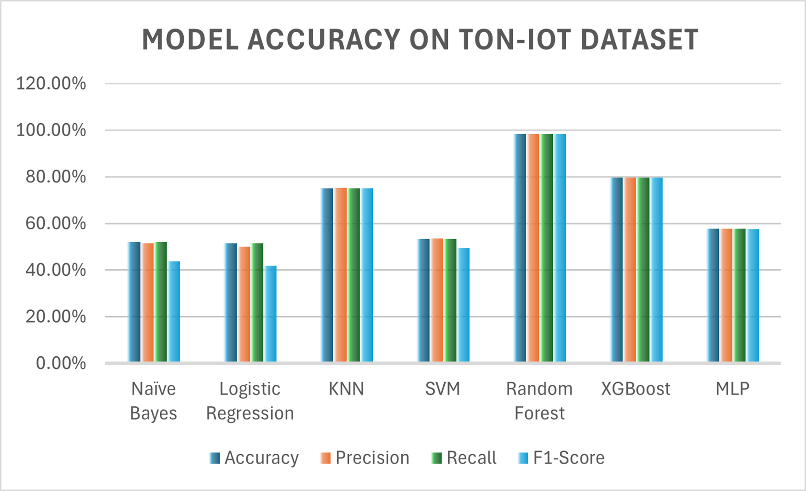
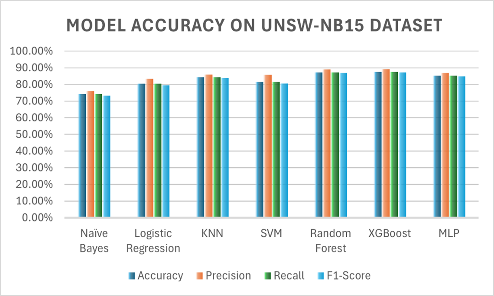

# IIoT Intrusion Detection System (IDS)

## Overview

This project presents a machine learning-based Intrusion Detection System (IDS) for Industrial Internet of Things (IIoT) environments.

The objective is to evaluate and compare multiple machine learning models for detecting malicious network traffic under different dataset conditions. The study focuses on identifying the most effective models for handling complex and non-linear IIoT network patterns.
This work also emphasizes reproducible experimentation using Git and DVC to ensure transparency and reliability of results.
---

## Motivation

Industrial IoT (IIoT) systems are increasingly used in critical infrastructures such as manufacturing and energy systems. These environments are vulnerable to cyberattacks that can disrupt operations and cause significant damage.

Traditional intrusion detection systems struggle to detect modern and unknown attacks. Therefore, this project investigates whether machine learning models—especially ensemble methods—can improve detection performance in complex IIoT environments.

The goal is to understand how different models behave under different dataset characteristics (balanced vs imbalanced, simple vs complex traffic).

--- 

## Models Implemented

* Naïve Bayes
* Logistic Regression
* k-Nearest Neighbors (KNN)
* Support Vector Machine (SVM)
* Random Forest
* XGBoost
* Multi-Layer Perceptron (MLP)

---

### Why These Models?

The selected models represent a diverse range of machine learning approaches:

- Probabilistic (Naïve Bayes)
- Linear (Logistic Regression)
- Distance-based (KNN)
- Margin-based (SVM)
- Ensemble learning (Random Forest, XGBoost)
- Neural networks (MLP)

This diversity allows comprehensive evaluation of how different learning paradigms perform under varying IIoT data conditions.

---

## Datasets Used

### TON-IoT Dataset
The TON-IoT dataset contains telemetry data from realistic IoT/IIoT environments, including industrial protocols such as Modbus. It represents relatively structured and balanced data, making it suitable for evaluating model performance under controlled conditions.

### UNSW-NB15 Dataset
The UNSW-NB15 dataset contains modern network traffic with diverse attack types and complex feature distributions. It includes imbalanced classes and more challenging patterns, making it suitable for testing model robustness.

### Why These Datasets?
Using both datasets allows comparison across different conditions:
- Balanced vs imbalanced data
- Simpler vs complex attack patterns
- Controlled vs realistic network environments

This helps evaluate how model performance changes depending on dataset characteristics.

---

## Project Structure

```
IIoT_IDS_Project/
├── data/        (managed by DVC)
├── models/      (managed by DVC)
├── results/     (managed by DVC)
├── reports/     (final outputs & visualizations)
├── src/
├── run_all.py
├── requirements.txt
└── README.md
```

---

## How to Run

1. Clone the repository:

```
git clone https://github.com/FahmidaKhalid/IIoT_IDS_Project.git
cd IIoT_IDS_Project
```

2. Install dependencies:

```
pip install -r requirements.txt
```

3. Pull datasets using DVC:

```
dvc pull
```

4. Run the project:

```
python run_all.py
```

---
## Experimental Pipeline

The project follows a structured machine learning pipeline:

1. Data preprocessing (cleaning, encoding, normalization)
2. Train-test split
3. Model training (7 algorithms)
4. Model evaluation using standard metrics
5. Result visualization and comparison

All steps are implemented in modular scripts inside the `src/` directory.

---
## Results

Key findings:

- Random Forest achieved the highest accuracy (98.42%) on the TON-IoT dataset due to its ability to handle structured and less noisy data effectively.
- XGBoost performed best (87.54%) on the UNSW-NB15 dataset, likely due to its robustness in handling complex and imbalanced data.
- Traditional models (Naïve Bayes, Logistic Regression) showed lower performance due to limited capability in capturing non-linear patterns.
- Ensemble methods consistently outperformed individual models across both datasets.

These results indicate that model performance strongly depends on dataset characteristics.These findings support the hypothesis that ensemble methods are better suited for handling complex and heterogeneous IIoT network data.

---
### Model Performance Visualization

#### TON-IoT Dataset


#### UNSW-NB15 Dataset


---

## Dataset Access Note

The dataset is managed using DVC (Data Version Control) and stored on a private university server.

Running `dvc pull` may require authentication due to access restrictions.

The dataset is not publicly exposed for security and access control reasons. However, if access is required, it can be shared separately upon request.

 Note: Large files such as datasets, trained models, and intermediate results are managed using DVC and are not directly stored in the Git repository.
 
---

## Reproducibility

This project ensures reproducibility through:

- Version-controlled code using Git
- Data versioning using DVC
- Modular pipeline structure (`run_all.py`)
- Fixed preprocessing and evaluation workflow

To reproduce results:
1. Clone the repository
2. Run `dvc pull` to retrieve datasets (authentication required)
3. Execute `python run_all.py`

Note: Access to datasets requires university credentials due to server restrictions.

---

## Limitations

- Hyperparameter tuning was kept limited to ensure fair comparison across models.
- Results are dependent on the selected datasets and may vary with other IIoT environments.
- Deep learning models were not extensively optimized due to computational constraints.

Future work can explore advanced tuning and additional datasets for further validation.

---

## Contribution

This project provides a comparative evaluation of multiple machine learning models for IIoT intrusion detection.

It demonstrates the effectiveness of ensemble learning methods (Random Forest and XGBoost) and introduces a structured and reproducible experimental pipeline for reliable evaluation.

---

## Notes for Evaluator

- The repository contains all code and pipeline logic.
- Large datasets are managed via DVC and stored on a secure university server.
- If access issues occur, datasets can be shared upon request.
