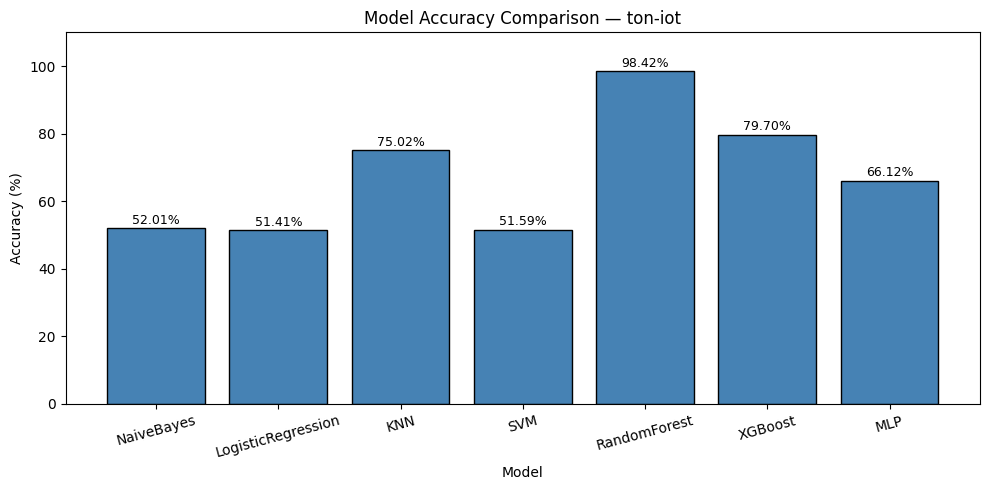
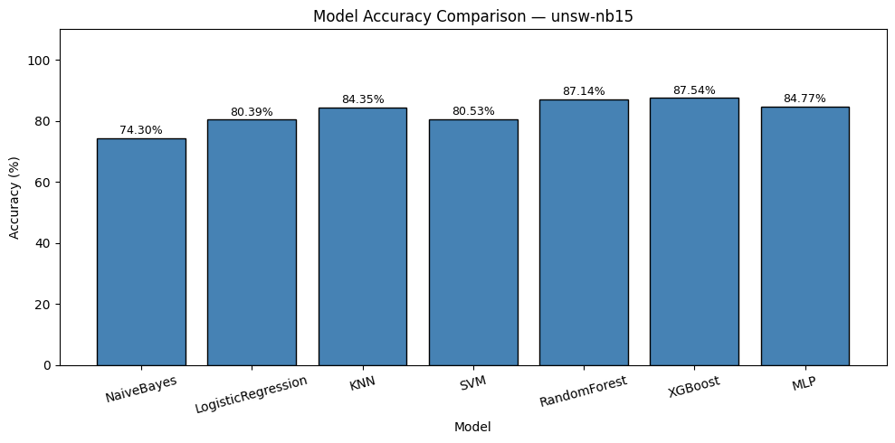
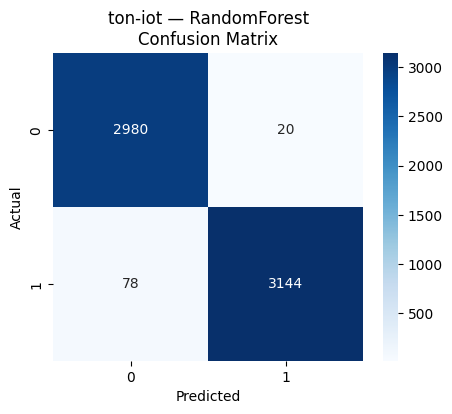
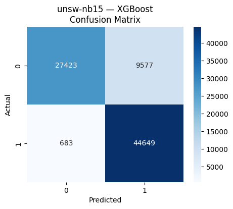
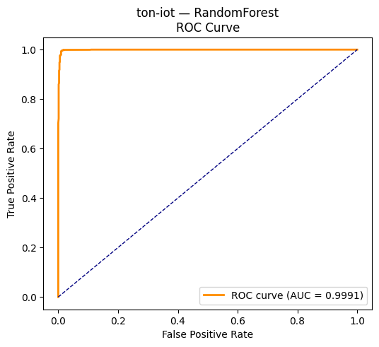
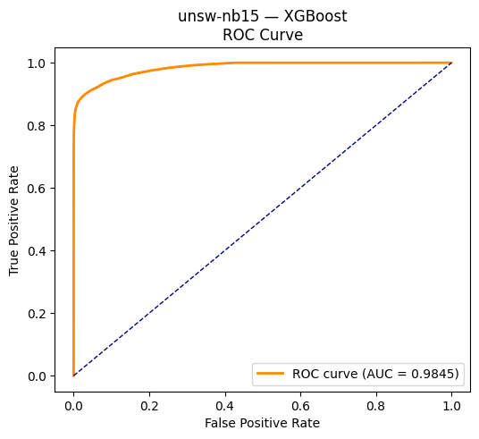
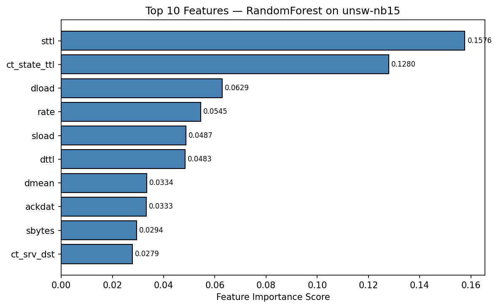
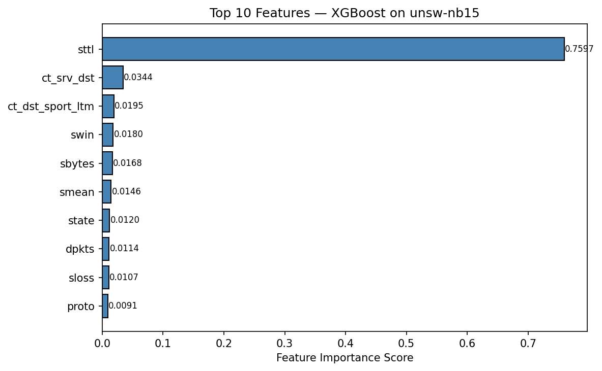

# IIoT Intrusion Detection System (IDS)

## Overview

This project presents a machine learning-based Intrusion Detection System (IDS) for Industrial Internet of Things (IIoT) environments.

The objective is to evaluate and compare multiple machine learning models for detecting malicious network traffic under different dataset conditions. The study focuses on identifying the most effective models for handling complex and non-linear IIoT network patterns.

This work emphasizes reproducible experimentation using Git and DVC to ensure transparency and reliability of results.

---

## Motivation

Industrial IoT (IIoT) systems are increasingly used in critical infrastructures such as manufacturing and energy systems. These environments are vulnerable to cyberattacks that can disrupt operations and cause significant damage.

Traditional intrusion detection systems struggle to detect modern and unknown attacks. Therefore, this project investigates whether machine learning models — especially ensemble methods — can improve detection performance in complex IIoT environments.

The goal is to understand how different models behave under different dataset characteristics (balanced vs imbalanced, simple vs complex traffic).

---

## Models Implemented

* Naïve Bayes
* Logistic Regression
* k-Nearest Neighbors (KNN)
* Support Vector Machine (SVM — Linear kernel)
* Random Forest
* XGBoost
* Multi-Layer Perceptron (MLP)

### Why These Models?

The selected models represent a diverse range of machine learning approaches:

| Type | Model |
|---|---|
| Probabilistic | Naïve Bayes |
| Linear | Logistic Regression |
| Distance-based | KNN |
| Margin-based | SVM |
| Ensemble (Bagging) | Random Forest |
| Ensemble (Boosting) | XGBoost |
| Neural Network | MLP |

This diversity allows comprehensive evaluation of how different learning paradigms perform under varying IIoT data conditions.

---

## Datasets Used

### TON-IoT Dataset
The TON-IoT dataset contains telemetry data from realistic IoT/IIoT environments, including industrial protocols such as Modbus. It represents relatively structured and balanced data, making it suitable for evaluating model performance under controlled conditions.

- Samples: 31,106
- Class distribution: Balanced (Normal: 15,000 / Attack: 16,106)

### UNSW-NB15 Dataset
The UNSW-NB15 dataset contains modern network traffic with diverse attack types and complex feature distributions. It includes imbalanced classes and more challenging patterns, making it suitable for testing model robustness.

- Samples: 50,000
- Class distribution: Imbalanced (Normal: 47,911 / Attack: 2,089)

### Why These Datasets?
Using both datasets allows comparison across different conditions:
- Balanced vs imbalanced data
- Simpler vs complex attack patterns
- IIoT-specific vs general network traffic

---

## Project Structure

```
IIoT_IDS_Project/
├── data/                    (managed by DVC)
├── models/                  (managed by DVC)
├── results/                 (managed by DVC)
├── reports/                 (final figures & visualizations)
├── src/
│   ├── config.py
│   ├── models.py
│   ├── preprocess.py
│   ├── train.py
│   ├── evaluate.py
│   └── explore.py
├── feature_importance.py
├── run_all.py
├── requirements.txt
└── README.md
```

---

## How to Run

**1. Clone the repository:**
```bash
git clone https://github.com/FahmidaKhalid/IIoT_IDS_Project.git
cd IIoT_IDS_Project
```

**2. Install dependencies:**
```bash
pip install -r requirements.txt
```

**3. Pull datasets using DVC:**
```bash
dvc pull
```

**4. Run the full pipeline:**
```bash
python run_all.py
```

**5. Generate feature importance plots:**
```bash
python feature_importance.py
```

---

## Experimental Pipeline

The project follows a structured and reproducible machine learning pipeline:

1. **Data Exploration** — class distribution, feature analysis
2. **Data Preprocessing** — cleaning, encoding, normalization, SMOTE for class imbalance
3. **Model Training** — 7 algorithms with 5-fold Stratified Cross-Validation
4. **Model Evaluation** — accuracy, precision, recall, F1-score, ROC-AUC
5. **Statistical Testing** — Wilcoxon Signed-Rank Test for significance
6. **Feature Importance** — Random Forest and XGBoost feature analysis
7. **Visualization** — confusion matrices, ROC curves, accuracy comparison charts

All steps are implemented in modular scripts inside the `src/` directory.

---

## Results

### TON-IoT Dataset

| Model | CV Accuracy | Test Accuracy | Test F1 | ROC-AUC |
|---|---|---|---|---|
| Naïve Bayes | 0.5202 ± 0.0012 | 52.01% | 43.76% | 0.5062 |
| Logistic Regression | 0.5161 ± 0.0017 | 51.41% | 41.82% | 0.5060 |
| KNN | 0.6920 ± 0.0062 | 75.02% | 75.02% | 0.8487 |
| SVM | 0.5174 ± 0.0017 | 51.59% | 39.21% | 0.5061 |
| **Random Forest** | **0.9619 ± 0.0019** | **98.42%** | **98.43%** | **0.9991** |
| XGBoost | 0.7805 ± 0.0042 | 79.70% | 79.66% | 0.8869 |
| MLP | 0.6509 ± 0.0114 | 66.12% | 66.08% | 0.7245 |

### UNSW-NB15 Dataset

| Model | CV Accuracy | Test Accuracy | Test F1 | ROC-AUC |
|---|---|---|---|---|
| Naïve Bayes | 0.8668 ± 0.0006 | 74.30% | 73.28% | 0.8345 |
| Logistic Regression | 0.9334 ± 0.0010 | 80.39% | 79.49% | 0.9341 |
| KNN | 0.9375 ± 0.0015 | 84.35% | 83.94% | 0.9290 |
| SVM | 0.9328 ± 0.0007 | 80.53% | 79.37% | 0.9299 |
| Random Forest | 0.9600 ± 0.0010 | 87.14% | 86.82% | 0.9790 |
| **XGBoost** | **0.9580 ± 0.0019** | **87.54%** | **87.24%** | **0.9845** |
| MLP | 0.9485 ± 0.0021 | 84.77% | 84.43% | 0.9600 |

### Key Findings

- **Random Forest** achieved the highest performance on TON-IoT (98.42% accuracy, ROC-AUC: 0.9991), benefiting from the dataset's balanced and structured nature.
- **XGBoost** performed best on UNSW-NB15 (87.54% accuracy, ROC-AUC: 0.9845), demonstrating its effectiveness on complex and imbalanced data.
- All model performance differences were statistically significant (Wilcoxon Signed-Rank Test, p < 0.05).
- Ensemble methods consistently outperformed traditional models across both datasets.

---

## Result Visualizations

### Accuracy Comparison

#### TON-IoT Dataset


#### UNSW-NB15 Dataset


### Confusion Matrix (Best Models)

#### Random Forest — TON-IoT


#### XGBoost — UNSW-NB15


### ROC Curves (Best Models)

#### Random Forest — TON-IoT


#### XGBoost — UNSW-NB15


### Feature Importance

#### Random Forest — UNSW-NB15


#### XGBoost — UNSW-NB15


---

## Dataset Access Note

The dataset is managed using DVC (Data Version Control) and stored on a private university server.

Running `dvc pull` may require authentication due to access restrictions. If access is required, datasets can be shared separately upon request.

**Note:** Large files such as datasets, trained models, and intermediate results are managed using DVC and are not directly stored in the Git repository.

---

## Reproducibility

This project ensures reproducibility through:

- Version-controlled code using Git
- Data versioning using DVC
- Fixed random seed (42) across all experiments
- 5-fold Stratified Cross-Validation for reliable performance estimation
- Modular pipeline structure (`run_all.py`)
- Consistent preprocessing and evaluation workflow

To reproduce results:
1. Clone the repository
2. Run `dvc pull` to retrieve datasets (authentication required)
3. Execute `python run_all.py`
4. Execute `python feature_importance.py`

---

## Limitations

- Hyperparameter tuning was intentionally limited to ensure fair comparison across models.
- Results are based on two benchmark datasets and may vary in other real-world IIoT environments.
- Experiments were conducted in an offline setting and do not reflect real-time deployment constraints.
- Advanced deep learning architectures (LSTM, CNN) were not included.

---

## Contributions

This project provides:

1. A comprehensive comparative evaluation of 7 machine learning models for IIoT intrusion detection
2. Multi-dataset evaluation across TON-IoT and UNSW-NB15 with different characteristics
3. 5-fold Stratified Cross-Validation with mean ± std reporting
4. Statistical significance testing using Wilcoxon Signed-Rank Test
5. ROC-AUC analysis and feature importance investigation
6. A structured and reproducible experimental pipeline

---

## Repository

GitHub: https://github.com/FahmidaKhalid/IIoT_IDS_Project

---

## Notes for Evaluator

- All code and pipeline logic are available in this repository.
- Large datasets are managed via DVC and stored on a secure university server.
- If access issues occur, datasets can be shared upon request.
